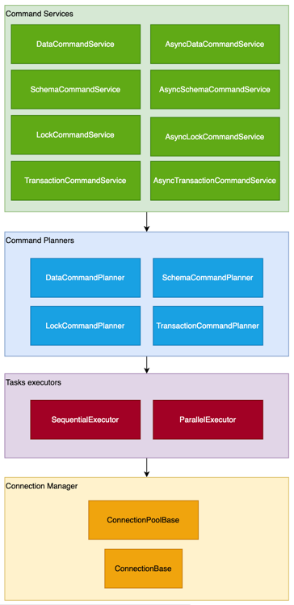

# AMSDAL Glue project overview

## Table of Contents

- [Packages overview](#packages-overview)
- [Repository structure](#repository-structure)
- [Architecture overview](#architecture-overview)
- [Quick start](#quick-start)

## Packages overview

The AMSDAL Glue project is a comprehensive Python interface that includes three main
packages: `amsdal-glue-core`, `amsdal-glue-connections`, and `amsdal-glue`. These packages work together to provide a
high-level abstraction for interacting with multiple databases simultaneously, simplifying the development and
maintenance process of database-related tasks in Python applications.

1. **amsdal-glue-core**: This is the core package of the AMSDAL Glue project. It provides the fundamental data models
   and interfaces that allow developers to implement their own solutions from scratch. It includes classes and functions
   for managing database connections, executing commands, and handling schema operations.

2. **amsdal-glue-connections**: This package provides the functionality for managing connections to different types of
   databases. It includes implementations for various connections such as SQLite, PostgreSQL, and others. It abstracts
   the specifics of each database type, allowing developers to interact with different databases using a unified
   interface.

3. **amsdal-glue**: This is the main package that developers interact with. It is a ready-to-use package that provides
   default implementations of all interfaces from the core package. It is designed to cover 90% of all tasks that a
   developer may encounter, providing a high-level interface for performing database operations, such as querying data,
   executing commands, and managing schemas.

Together, these packages make the AMSDAL Glue project a powerful tool for working with databases in Python applications.
They enable developers to interact with multiple databases simultaneously, abstract the specifics of each database type,
and simplify the process of writing and maintaining database-related code.

## Repository structure

- `/libs/core/`: Contains the source code for the `amsdal-glue-core` package.
- `/libs/connections/`: Contains the source code for the `amsdal-glue-connections` package.
- `/libs/glue/`: Contains the source code for the `amsdal-glue` package.

## Architecture overview

The architecture of the AMSDAL Glue project is primarily defined in the amsdal-glue-core package, which serves as the
foundation for the entire project. The other two packages, amsdal-glue-connections and amsdal-glue, build upon this
foundation by providing implementations of the interfaces and data structures defined in the core package.

The core package defines the data structures and interfaces that form the basis of the AMSDAL Glue project. It acts as a
data protocol, outlining the rules for how data is structured and how different interfaces interact with each other.
This allows developers to implement their own solutions from scratch, providing a high degree of flexibility and
control.

The architecture of the AMSDAL Glue project follows the CQRS pattern. This means that operations on data are divided
into two distinct types: queries (which retrieve data) and commands (which modify data). This separation of concerns
makes the system easier to understand and maintain, and allows for greater flexibility in how operations are
implemented.

Here is a diagram that illustrates the architecture of the Queries in the AMSDAL Glue project:

<div style="text-align: center; margin-top: 20px;">
    <figure>
        
        <figcaption>Architecture diagram</figcaption>
    </figure>
</div>

In this diagram, we can see there are four main components:

- Query services
- Query planners
- Tasks executors
- Connection manager

The query services are high level interfaces that user interacts with to perform queries. They are several query
services:

- DataQueryService - for querying data
- AsyncDataQueryService - for querying data asynchronously
- SchemaQueryService - for querying schemas
- AsyncSchemaQueryService - for querying schemas asynchronously

The service is responsible for interacting with the query planner to create a query plan, run tasks execution, and
forming the final result (including handling execution errors).

The planner's role is to formulate a query plan derived from the query request. It dissects the query into tasks and
organizes them into a plan using chain and group tasks, all of which is contingent on the input query and the
established set of connections.

The task executor is responsible for executing the tasks in the query plan.
The chain task executor is responsible for executing tasks sequentially, while the group task executor is responsible
for executing tasks in parallel.

The connection manager is responsible for managing the connections to the databases. It operates with the connection
pool, which provides an ability to reuse connections and manage their lifecycle for performance optimization.

The similar architecture is applied to the Commands in the AMSDAL Glue project:

<div style="text-align: center; margin-top: 20px;">
    <figure>
        
        <figcaption>Architecture diagram</figcaption>
    </figure>
</div>

As we can see, there are more services for commands, that includes services for locking, transactions, schema and data
management commands.

# Quick start

To get started with the AMSDAL Glue project, you need to:

1. Register all managers, services, executors.
2. Register all connection pools via ConnectionManager.

The `amsdal-glue` package provides a convenient way to get started with the AMSDAL Glue project. It includes default
implementations of all interfaces from the core package, allowing you to quickly set up and start using the project
without having to write any custom code.

Here is an example of how to get started with the AMSDAL Glue project using the `amsdal-glue` package:

```python
from amsdal_glue.initialize import init_default_containers

init_default_containers()
```

This code initializes the default containers, which register all managers, services, and executors needed to start
working with the AMSDAL Glue project. Once you have initialized the containers, you can start registering connection
pools via the ConnectionManager and begin interacting with databases using the high-level interfaces provided by the
`amsdal-glue` package:

```python
from amsdal_glue import DefaultConnectionPool
from amsdal_glue import SqliteConnection
from amsdal_glue import Container
from amsdal_glue.interfaces import ConnectionManager

sql_connection_pool = DefaultConnectionPool(SqliteConnection, db_path='customers.sqlite', check_same_thread=False)
connection_mng = Container.managers.get(ConnectionManager)

# Register the connection pool as default one (not related to any schema)
connection_mng.register_connection_pool(sql_connection_pool)
```

Read more about connection manager, pools and multiple databases connections in
the [Multiple connections](multiple-connections.md) section.

More examples of queries and commands can be found in the [Examples](examples.md) section.

